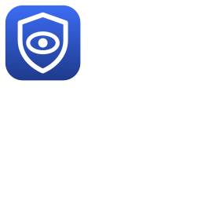
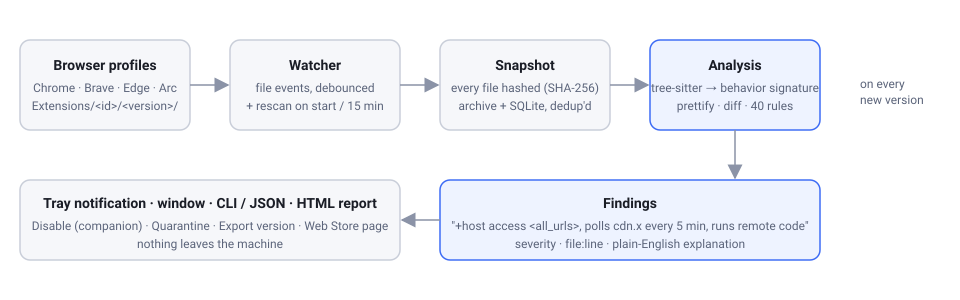
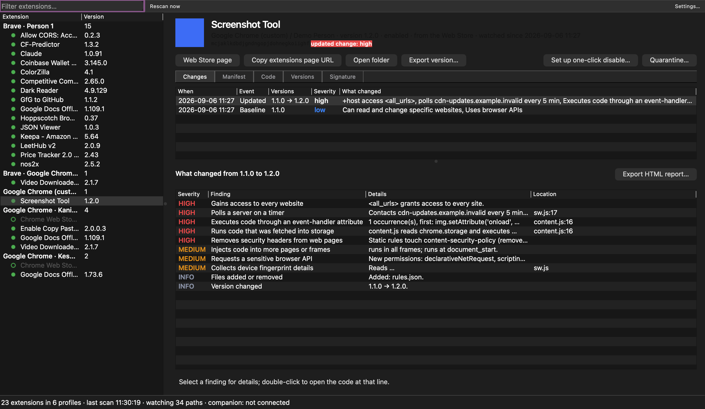
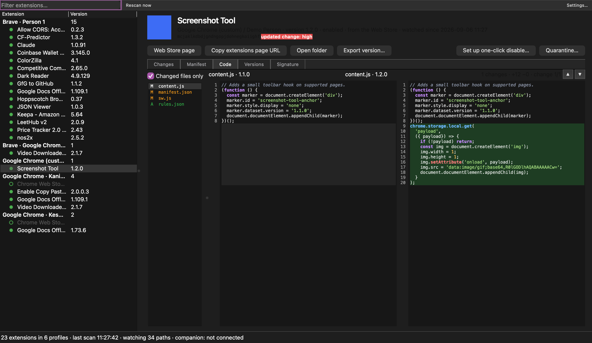

<div align="center">
  
  <h1>ExtWatch</h1>
  <p>
    <strong>Your browser extensions update themselves at night. ExtWatch reads the diff so you don't have to.</strong>
  </p>
  <p>
    <a href="#why-extwatch">Why</a> &middot;
    <a href="#how-it-works">How it works</a> &middot;
    <a href="#security-model">Security</a> &middot;
    <a href="#quick-start">Quick start</a>
  </p>
</div>

---

## Why ExtWatch?

An extension you installed years ago is not the extension running today. Extensions get sold,
developer accounts get phished, and the next silent update turns a screenshot tool into
spyware. QuickLens did exactly that in 2026: kept its features, added a five-minute poll to a
server for JavaScript to run on every page. The Great Suspender, Nano Adblocker, Stylish and the
35 extensions of the Cyberhaven wave went the same way. The browser shows nothing, because
nothing about the update looks wrong to the browser.

ExtWatch is a small tray app for macOS, Windows and Linux that watches what your extensions
actually do, version after version, on your own machine.

- **Sees every install** - Chrome, Chromium, Edge, Brave, Vivaldi, Opera and Arc, every profile,
  read straight from the browser's own files.
- **Keeps every version** - content-addressed archive, so a hundred versions of a 5 MB extension
  cost a few MB. Export any of them as a zip.
- **Catches silent updates in seconds** - a file watcher per profile, plus rescans on start and
  every 15 minutes. Versions that are downloaded but not yet running are reported first.
- **Explains the change** - the code is parsed, reduced to a behavior signature, and diffed against
  the previous version. Fifty-one rules turn the difference into findings a normal person can read, and anything the analyzer could not inspect is reported rather than passed off as clean.
- **Shows the code** - side by side, prettified, highlighted, with each finding linked to its line.
- **Lets you act** - one-click Disable through a tiny companion extension, quarantine, export,
  share a report.
- **Local only** - no account, no server, no telemetry. The one optional network feature is off
  by default.

## How It Works

<div align="center">
  
</div>

1. **Discover** - find every user data directory and profile, list the extensions and read
   `Secure Preferences` for the active version and enabled state.
2. **Snapshot** - hash every file, store new blobs in the archive, record the version and its
   manifest in SQLite. The first snapshot of an extension is its baseline.
3. **Watch** - a file-system watcher on each profile notices the new `Extensions/<id>/<version>/`
   directory the moment the browser writes it.
4. **Analyze** - both versions are parsed with tree-sitter: domains it talks to, `chrome.*` APIs,
   code run from strings, storage read next to `eval`, header-stripping rules, keystroke listeners,
   fingerprinting reads, obfuscation.
5. **Explain** - the rules compare the two signatures and produce findings with a severity, a
   sentence, and a `file:line`.
6. **Show** - a tray notification with the one-line summary, and a window with the findings, the
   manifest diff and the code diff.

<div align="center">
  
</div>

The notification for the update above reads:

```
Screenshot Tool 1.1.0 → 1.2.0
+host access <all_urls>, polls cdn-updates.example.invalid every 5 min,
executes code through an event-handler attribute
```

The malicious payload is never in the package, so the rules look for the loader: a timer plus a
network call to a new domain in the same file, `chrome.storage` reads next to `eval`, an `on*`
attribute set from a variable, rules that strip `Content-Security-Policy` from every page, new
`<all_urls>` access, a changed signing key or update URL. Every finding opens the code at the
exact line, prettified so a 20,000-line minified bundle diffs like source:

<div align="center">
  
</div>

## Security Model

Monitoring and analysis are read-only: ExtWatch never writes to browser preferences and never
sends data anywhere. It changes browser state only when you explicitly use Disable, Quarantine or
Restore, and each of those acts on exactly the browser profile shown on screen.

### Protected Today

- **Everything is local** - the archive, the database and the reports live in your user data
  directory. The only network access, Web Store publisher tracking, is opt-in.
- **Tamper check** - Chrome writes the signing key into every unpacked `manifest.json`; ExtWatch
  verifies that it derives to the extension ID.
- **Reproducible findings** - every version has a tree hash and every report names the rules
  version, so two machines with the same files get the same result.
- **Small companion** - the optional extension has only `management` and `nativeMessaging`
  permissions, no page access, no network, about 150 lines you can read in a minute.

### Known Limits

| Limit                | Details                                                                                                                       |
| -------------------- | ----------------------------------------------------------------------------------------------------------------------------- |
| Static analysis      | ExtWatch reads code, it does not run it. Heavily obfuscated loaders can hide; the obfuscation itself is flagged, and any file it could not analyze is reported as such. |
| Same-user malware    | Another program running as you can read the archive and talk to the companion socket. Root or a kernel compromise is out of scope. See [docs/THREAT_MODEL.md](docs/THREAT_MODEL.md). |
| Disable needs help   | Browsers refuse `chrome://` links from other apps and protect their preferences, so one-click Disable goes through the companion extension. Without it, Quarantine moves the files so the browser refuses to run them. |
| Unsigned builds      | Until certificates are added, Gatekeeper and SmartScreen warn once. Signing and notarization are wired into the release workflow. |
| First scan cost      | The first run analyzes every extension once. With a 44 MB wallet extension installed that takes about 40 seconds in the background; later scans take about a second. |

## Quick Start

```bash
git clone https://github.com/kanishka0411/extWatch.git
cd extWatch
cmake --preset dev-mac          # dev-linux on Linux, ci-windows on Windows
cmake --build --preset dev-mac
./build/dev-mac/src/extwatch --show
```

Requirements: CMake 3.24+, Ninja, a C++20 compiler and Qt 6.5+. On a Mac,
`brew install qt cmake ninja` covers it. Everything else is fetched at configure time.

Run `extwatch` without arguments and it lives in the tray. The first scan records every extension
as a baseline; after that you only hear about changes. The same binary is the command line:
`extwatch scan --json`, `extwatch diff <id> <old> <new>`, `extwatch analyze <dir|zip|crx>`,
`extwatch --help` for the rest.

### See it catch something

The repo ships a fixture extension in three versions. 1.0.0 and 1.1.0 are harmless; 1.2.0 is a
faithful copy of the QuickLens loader, pointed at `.invalid` domains so it can never connect.

```bash
tools/make_fixture_profile.py fixtures/generated/user-data --version 1.1.0
export EXTWATCH_DATA_DIR=$PWD/fixtures/generated/data
export EXTWATCH_USER_DATA_DIRS="chrome=$PWD/fixtures/generated/user-data" EXTWATCH_USER_DATA_DIRS_ONLY=1
./build/dev-mac/src/extwatch --show
```

In a second terminal, let the update land, then watch the notification:

```bash
tools/make_fixture_profile.py fixtures/generated/user-data --update 1.2.0
```

Release builds (macOS dmg, Windows installer, Linux AppImage) come from the GitHub release
workflow on every `v*` tag; the scripts in `packaging/` build the same locally.

## License

MIT
